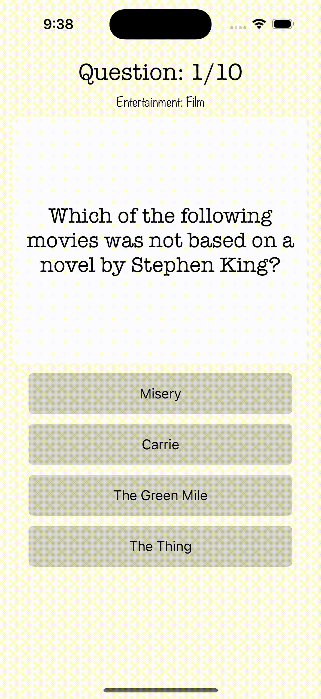

# Project 4 - *MovieMania*

Submitted by: **Vasanth Banumurthy**

**MovieMania** is a trivia app that challenges even the mightiest movie nerds!

Time spent: **5** hours spent in total

## Required Features

The following **required** functionality is completed:

- [X] User can view and answer at least 5 trivia questions.
- [X] App retrieves question data from the Open Trivia Database API.
- [X] Fetch a different set of questions if the user indicates they would like to reset the game.
- [X] Users can see score after submitting all questions.
- [X] True or False questions only have two options. 

NOTE: App only features multiple choice as design decision
The following **optional** features are implemented:

  
- [ ] Allow the user to choose a specific category of questions.
- [X] Provide the user feedback on whether each question was correct before navigating to the next.

The following **additional** features are implemented:

NA

## Notes

HTML parsing necessary. Used [SwiftSoup](https://github.com/scinfu/SwiftSoup)

## License

    Copyright [2023] [Vasanth Banumurthy]

    Licensed under the Apache License, Version 2.0 (the "License");
    you may not use this file except in compliance with the License.
    You may obtain a copy of the License at

        http://www.apache.org/licenses/LICENSE-2.0

    Unless required by applicable law or agreed to in writing, software
    distributed under the License is distributed on an "AS IS" BASIS,
    WITHOUT WARRANTIES OR CONDITIONS OF ANY KIND, either express or implied.
    See the License for the specific language governing permissions and
    limitations under the License.
